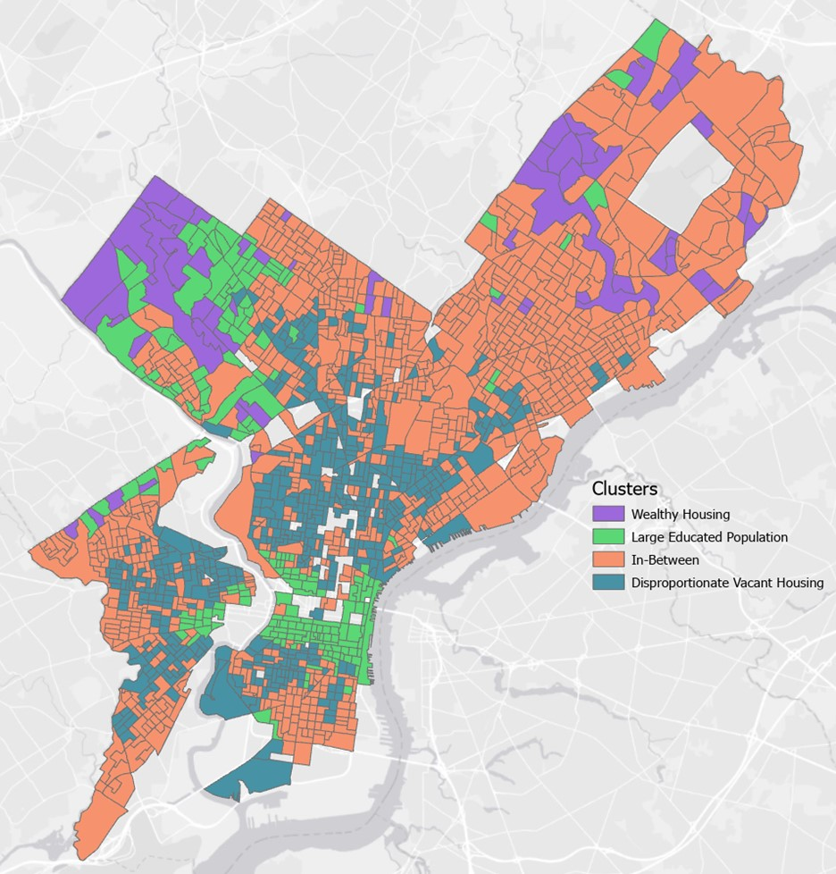

<br>

**Authors: Nohman Akhtari, Alec Jacobs, Trevor Kapuvari | 12.20.2023**

Course: Statistical And Data Mining Methods For Urban Spatial Analytics

<br>

```{r clear_environment, cache = TRUE, include = FALSE}

# Lists All Of The Objects In The Work Space

rm(list=ls())

```

```{r knitting_options, include = FALSE}

# Global Options For Knitting Chunks

knitr::opts_chunk$set(echo = T, cache = T, messages = F, warning = F, error = F)

```

```{r warning=FALSE, message=FALSE, cache=FALSE, include = FALSE}

# Loading In Project Specific Library Packages

options(scipen=999)
                 
library(sf)
library(spdep)
library(spgwr)
library(tmap)
library(spatialreg)
library(whitestrap)
library(lmtest)
library(tseries)
library(tidyverse)
library(gtsummary)
library(gt)
library(knitr)
library(kableExtra)
library(NbClust)
library(flexclust)

```

```{r color_palette, include = FALSE}

# Setting Specific Color Palettes For Visualizations

paletteV1 <- c("#FF5500", "#E6872D", "#FFA500", "#CAE4F1", "#7097A8", "#21505A")

```

# **INTRODUCTION**

<br> 

In previous assignments, we analyzed Philadelphia’s median home values using socioeconomic indicators across block groups. To further identify potential spatial autocorrelation in these indicators at the block group level, we will run a k-means cluster analysis to inform us on an optimal number of block group clusters within the city. K-means clustering will also help explain patterns in the data; segment the data based on similarities; and simplify the overall dataset into aggregates that are easier to comprehend from a non-technical standpoint. Then, we use these evaluated cluster solutions to aggregate the block groups into the recommended amount of clusters. In turn, these aggregates will allow us to assess if there is a coherent solution based on the variables provided, evaluating mean values of variables within each cluster and examining how each cluster was categorized. The variables used in the cluster analysis are: median house value, median household income, percent of individuals with at least a bachelor’s degree, percent of single/detached housing units, and percent of vacant housing units. This analysis, given these variables, enables multiple use-cases that can benefit urban planners, identifying socio-economic segmentation, real estate market analysis, and housing unit composition.

<br>

# **METHODS & LIMITATIONS**

<br>

A K-means algorithm aims to aggregate observations of similar values into the same cluster; the amount of clusters is determined by “K” and needs to be pre-determined by the user. The algorithm then attempts to categorize each observation to a cluster and measures the distance between the observation and the centroid of the cluster it is categorized in. The algorithm repeats this process of assigning observations into clusters until the average distance from the data points to their respective cluster centroid is minimized. This final iteration is the optimized cluster groupings where all points are considered stable and grouped with their best-fitted centroid. 

One major limitation of the algorithm is that it requires input from the user to determine the optimal number of clusters for a given dataset, allowing for potential human error. In R, there are packages that feature 30 different criteria that help determine which number of clusters is optimal for our analysis based on the variables and values given. For our analysis, we used 26 criteria most relevant to our data. Another limitation is that k-means clustering is unable to account for variations in population density across block groups. This limitation may affect our cluster analysis as census block groups can vary in population between 600 - 3,000 people. Lastly, any outliers present in the data may disproportionately impact the algorithm regarding centroid calculations, as the centroid’s location may be compensating to the outlier rather than where it would otherwise be with more uniform data. In sum, the limitations include manual specification of clusters; assumption of clusters to be the same size and density; struggle to accommodate noise and outliers; and desire to the find local minimums rather than global minimums.

Other cluster algorithms include Density-Based Spatial Clustering of Application with Noise (DBSCAN), Gaussian Mixture Model (GMM), or Hierarchical Clustering. DBSCAN is ideal for spaces that have irregularly shaped boundaries (such as census block groups), and can account for density within these spaces and thus help identify outliers within the dataset. GMM takes a different approach to its clustering compared to K-means, as the model clusters through probability of data point reliability to its aggregate, making its categorization flexible and more loosely interpreted. Hierarchical clustering forms a tree-like hierarchy of all clusters; while a number is still determined by the user, this method better highlights discrepancies in each block group by showing more scale in values rather than treating each cluster as equal. The only clustering that may also be appropriate for this problem is hierarchical clustering.

Our methods for concluding an optimal amount of clusters will be determined through NbClust in R, and therefore can use that amount to create rankings of clusters that analyze each spatial region’s characteristics and discrepancies. The issue with DBSCAN in this scenario is, while it accounts for density such as for population, our data does not include the population for each block group, which renders DBSCAN’s advantage useless. GMM is not appropriate here because we are seeking strict boundaries and defined clusters for each block group, and having mixed associations based on probability will not be informative in an analysis. 

<br>

# **RESULTS**

<br>

The NbClust command in R is an algorithm package that provides 30 indices that determines the optimal number of clusters for the user and the best clustering methods for various results. For our cluster analysis we used this package and found that among all indices, 4 clusters were recommended most among all possibilities. Among the 30 criteria measured, 8 recommended using 4 clusters, resulting in a majority rule. The scree plot provides us with the difference in cluster values using the Hubert Index. The index measures the distance between points of the same cluster and the structure of each cluster. The higher the index value the better the clustering structure, ensuring data points are truly clustered together. As mentioned by the output referring to the Hubert index, the ideal amount of clusters creates a “knee” shape in the graph that increases the amount of clusters but does not sacrifice the value of the index. 

We also examine the graph that shows the Hubert statistic second difference, which helps us identify the number of clusters where changes are statistically significant or insignificant. Too many clusters can create clusters of similar categories that the analysis would portray as two with distinct characteristics - inaccurately displaying the region. The optimal number of clusters can be found with a “elbow” shape when the increase in clusters no longer adds substantial value to the index, showing a decrease in slope. We find this “elbow point” in NBClust Command and Scree plot where the change in slope between cluster amounts of 4 and 6 on the graph to the right indicates a Hubert second difference value of roughly 0.0004.  

The Dindex value measures the quality of distinction between each cluster, where a higher value represents better separation between each cluster. This value has to also be looked at with the Second Differences Dindex value that represents the rate of change in the Dindex value with respect to the number of clusters. Similarly to the Hubert statistic, finding an “elbow” determines the number of clusters used. We see a plateau where significance between cluster amounts decreases. We also observe the elbow point in the plot where the decrease begins at 4 & 6 clusters, further indicating the optimal number of clusters is between 4 and 6. 

The table produced by the aggregate command provides the mean value of each variable within their respective clusters. Each cluster has its own outlying characteristic in at least one variable that distinguishes it from the other clusters. Cluster 1 has a drastically higher percentage of vacant housing (PCTVACANT). Cluster 3 has the highest percentage of university educated people with a bachelors or more (PCTBACHMOR). Cluster 4 has the highest median household income (MEDHHINC) and highest median home value (MEDHVAL). Cluster 2 does not have any distinct quantitative metrics that separates it from any other cluster, acting as an in-between cluster without a defined characteristic, especially noting that cluster 2 is the largest size with 950 block groups included. Each cluster can be described as the following:

<br>

* **Cluster 1: Disproportionate Vacant Housing**
* **Cluster 2: In-Between**
* **Cluster 3: Large Educated Population**
* **Cluster 4: Wealthy Housing**

<br>

```{r read_data, include = FALSE, results=FALSE}

# Reading In Data Needed To Complete Assignment

RegD = read.csv("C:/Users/alecj/Desktop/HW05_Statistics_MUSA5000/RegressionData.csv")

df <- data.frame(scale(RegD[-2:-1]))

head(df)

```

```{r warning=FALSE, message=FALSE, results=FALSE}

Scree <- (nrow(df)-1)*sum(apply(df,2,var))
for (i in 2:20) Scree[i] <- sum(kmeans(df, 
                                     centers=i)$withinss)
plot(1:20, Scree, type="b", xlab="Number Of Clusters",
     ylab="Within Groups Sum Of Squares")

```

```{r warning=FALSE, message=FALSE}

set.seed(1234)
nc <- NbClust(df, min.nc=2, max.nc=15, method="kmeans", index="all")

```

```{r warning=FALSE, message=FALSE, results=FALSE, error=FALSE}

table(nc$Best.n[1,])

```

```{r warning=FALSE, message=FALSE, cache=FALSE, error=FALSE}

par(mfrow=c(1,1)) 
barplot(table(nc$Best.n[1,]),
        xlab="Numer Of Clusters", ylab="Number Of Criteria",
        main="Number Of Clusters Chosen By 26 Criteria")

```

```{r warning=FALSE, message=FALSE, cache=FALSE, results=FALSE}

set.seed(1234)

fit.km <- kmeans(df, 4, nstart=25)

fit.km$size

```

```{r warning=FALSE, message=FALSE, cache=FALSE, results=FALSE}

round(fit.km$centers, 2)

fit.km$cluster

```

```{r warning=FALSE, message=FALSE, cache=FALSE, error=FALSE}

clustertable <- cbind(round(aggregate(RegD[-1:-1], by=list(cluster=fit.km$cluster), mean),1),fit.km$size)

clustertable %>%
  kbl() %>%
  kable_minimal("hover", full_width = F)
```

```{r warning=FALSE, message=FALSE, cache=FALSE, results=FALSE}

ct.km <- table(RegD$POLY_ID, fit.km$cluster)


write.csv(ct.km, file = "clusterfit.csv")

```

```{r warning=FALSE, message=FALSE, cache=FALSE, results=FALSE}

round(randIndex(ct.km),1)

```

<br>

The following map depicts each block group’s associated cluster in Philadelphia. The K-Means clusters also tend to cluster in the area to certain extents. With some notable exceptions, the K-Means cluster proves some spatial autocorrelation throughout the area. Cluster 3 and 4 (purple and green) tend to mix between one another because of the correlation between education and income. Block groups in the purple cluster, being the wealthy suburbs, are also sometimes classified as large educated populations, shown in green. This classification is not incorrect, however, it is not as accurate as saying it is also a part of the wealthy suburb. The most cohesive cluster for the educated population is central Philadelphia (green), relatively far from any purple block groups and accurately defined as a large educated population with high-income attributes. Green block groups outside of the Center City & University City cluster may be better associated with the wealthy housing cluster. One variable not factored in the analysis is age, which could have distinguished this difference between the educated population versus the wealthy suburban block groups. 

In terms of Clusters 1 (vacant housing, shown in blue), we notice clearly defined clusters in the areas surrounding Center City showing spatial autocorrelation. Cluster 2 (In-Between, shown in orange), can be considered spatially autocorrelated except for the fact it functions more as a filler cluster for block groups that are not appropriate for other clusters. Overall, the vacant housing cluster and in-between cluster appear spatially autocorrelated and well-defined. The education cluster is defined in its own area except when adjacent to the wealthy cluster, where it tends to blend into one another, ultimately creating a generalizable analysis of how Philadelphia is characterized throughout.

<br>



<br>

# **DISCUSSION**

<br>

In summary, our analysis involved applying k-means clustering to study five variables, resulting in the formation of four distinct clusters representing diverse socioeconomic segments and their corresponding house values. The vacant housing and in-between clusters demonstrate spatial autocorrelation and clear distinctions. The education cluster maintains its distinctiveness in most regions but exhibits blending with the wealthy cluster, contributing to a comprehensive analysis of Philadelphia's overall characterization. The clustering process effectively identifies these groups and while the findings may not be surprising, the map explores the spatial distribution of these clusters - unveiling a noticeable spatial autocorrelation.